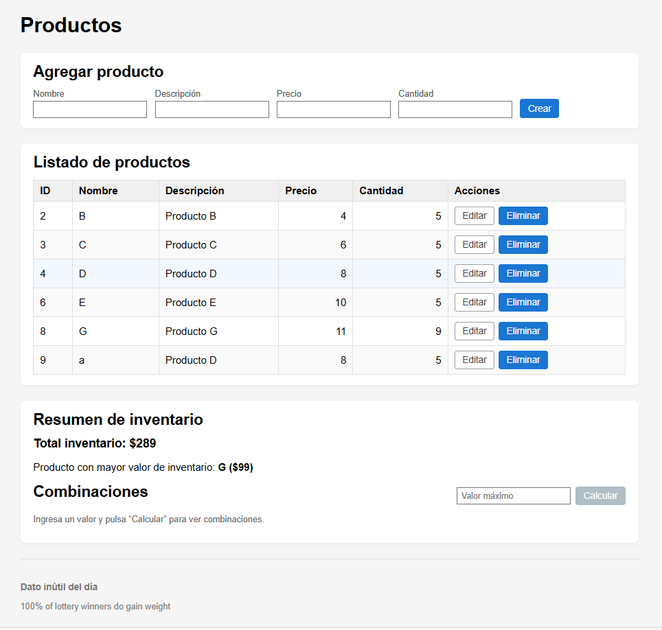
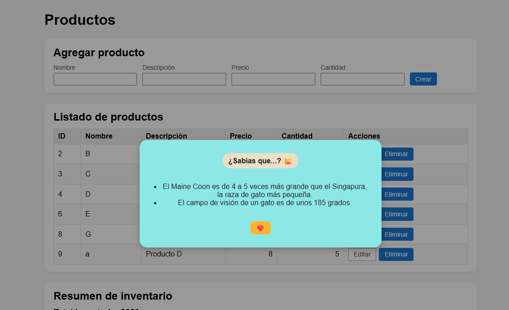
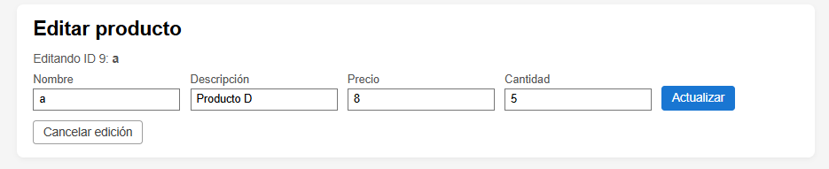

# Prueba técnica CRUD de productos

Este repositorio contiene el backend en Spring Boot y el frontend en React para la prueba técnica de gestión de productos e inventario.

## Descripción general

La aplicación permite:
- Gestionar productos (crear, listar, actualizar y eliminar lógicamente).
- Calcular y mostrar el valor total del inventario y el producto con mayor valor de inventario.
- Obtener combinaciones de productos cuya suma de precios sea menor o igual a un valor ingresado.
- Mostrar dos datos curiosos sobre gatos en un modal al cargar la página.
- Mostrar un “dato inútil del día” en el pie de página.

## Estructura del proyecto

PTM_TEST/
  backend/       # Backend Spring Boot
  frontend/      # Frontend React
  schemas/       # Scripts SQL de base de datos
  README.md      # Indicaciones del proyecto


## Requisitos

- Java 17 (o la versión configurada en el proyecto).
- Maven.
- Node.js y npm.
- MySQL.
- Git.


## Configuración de la base de datos

1. Crear la base de datos ejecutando el script `schemas/schema.sql` en MySQL.
2. Verificar que la base de datos se llame `crud_app`.

Configurar las credenciales en `backend/src/main/resources/application.properties`:
Ajusta usuario, contraseña y propiedades según tu entorno.

---

## Backend (Spring Boot)

1. Ir a la carpeta del backend:
```
cd backend
```

2. Compilar y descargar dependencias:

```
mvn clean install
```

3. Ejecutar la aplicación:

```
mvn spring-boot:run
```
El backend quedará disponible en `http://localhost:8080`.

El backend expone:
- Operaciones CRUD sobre productos.
- Endpoint para el valor total de inventario y el producto con mayor valor.
- Endpoint para obtener combinaciones de productos según un valor máximo.
- Solo considera productos activos (eliminación lógica).

---

## Frontend (React)

1. En otra terminal, ir a la carpeta del frontend:

```
cd frontend
```

2. Instalar dependencias:

```
npm install
```

3. Ejecutar la aplicación:

```
npm start
```

El frontend quedará disponible en `http://localhost:3000`.

Asegúrate de que las URL usadas en el código React apunten al backend, por ejemplo:

```
const API_BASE_URL = 'http://localhost:8080';
```

---

## Funcionalidades del frontend

- Tabla de productos con ordenamiento en el cliente.
- Formularios para crear y editar productos.
- Eliminación lógica (los productos eliminados dejan de mostrarse y no se usan en combinaciones).
- Visualización del total de inventario y del producto con mayor valor.
- Sección “Combinaciones”:
  - Input numérico y botón “Calcular”.
  - Muestra la lista de combinaciones o el mensaje:
    - “No hay combinaciones para el valor ingresado” cuando el backend retorna una lista vacía.
- Modal “¿Sabías que...?”:
  - Carga 2 datos de gatos desde `https://github.com/wh-iterabb-it/meowfacts` en español.
- Footer:
  - Muestra el “dato inútil del día” desde `https://uselessfacts.jsph.pl/`.

---

## Cómo ejecutar todo

1. Iniciar MySQL y crear la base con `schemas/schema.sql`.
2. Iniciar el backend:
   - `cd backend`
   - `mvn spring-boot:run`
3. Iniciar el frontend:
   - `cd frontend`
   - `npm start`
4. Abrir `http://localhost:3000` en el navegador y probar:
   - CRUD de productos.
   - Total de inventario y producto con mayor valor.
   - Combinaciones con distintos valores.
   - Modal de gatos y dato inútil del día.

---

## Notas

- La eliminación es lógica mediante un campo de estado, por lo que los registros no se borran físicamente.
- Si cambias puertos o URL, actualiza tanto la configuración del backend como las llamadas del frontend.

## Capturas de la aplicación

### Vista principal


### Combinaciones


### Modal de datos curiosos


### Edición de productos


